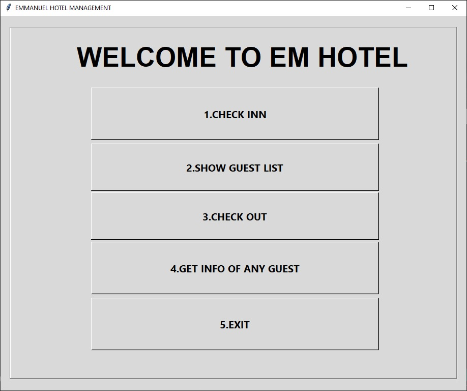
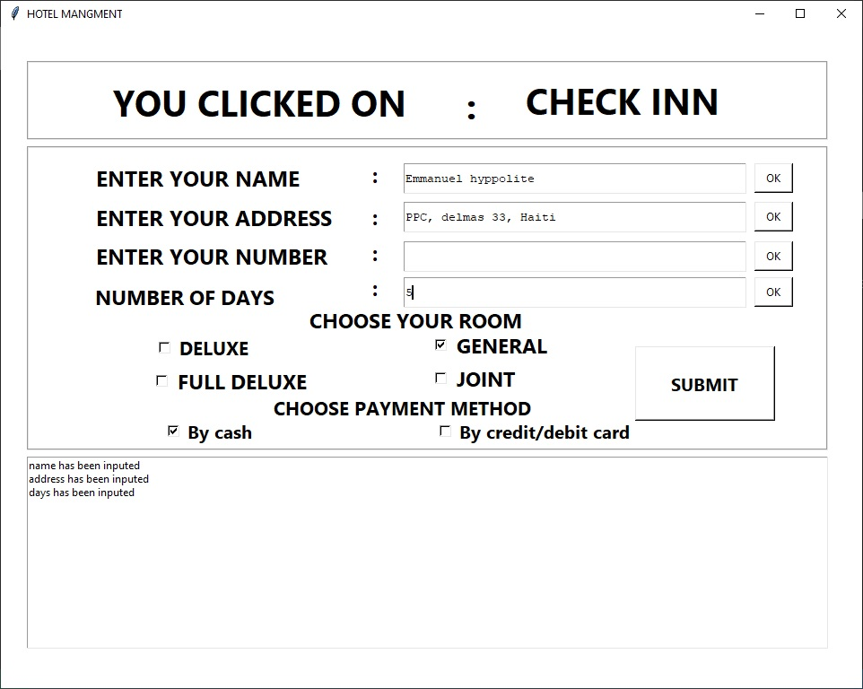
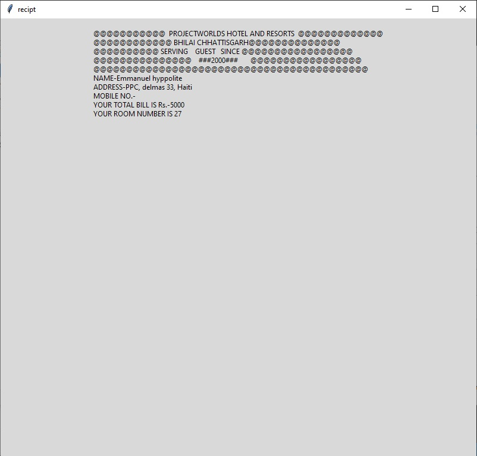
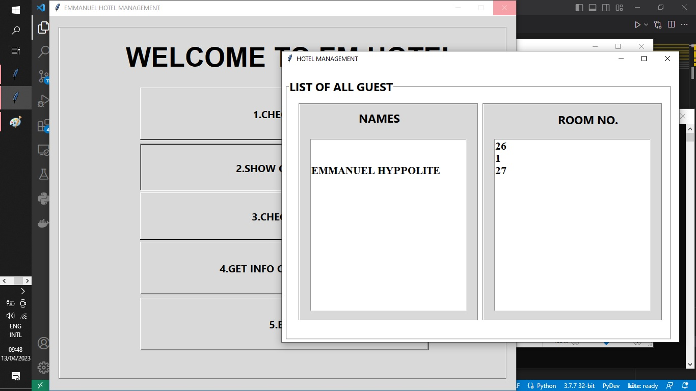

# EM-HOTEL-MANAGEMENT
Simple Hotel Management System project is written in Python

 

- the user has to enter his/her data. It includes the name of the user, address, check-in, and check-out dates. 
- The user can calculate room rents. 
- Inside this section, there are total four types of room with different prices. 
- After selecting the room type, the system asks to enter the number of nights spent in order to calculate room rent. 

 

